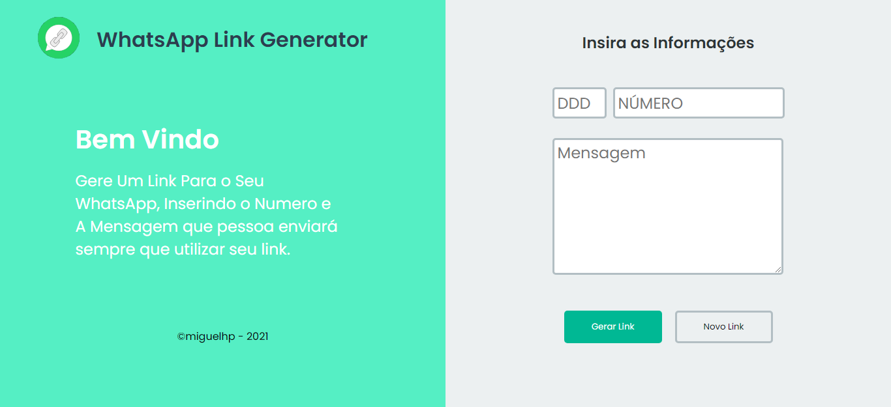

<h1 align='center'>WhatsApp Link Generator</h1>
<h1 align="center">
    
</h1>

<h3 align='center'> Um Aplicativo Gerador de Links Para Direcionar Uma Pessoa Ao Seu Número de WhatsApp! 🔗</h3>

## 🚀 Tecnologias

* Typescript
* ReactJs

## 🖥️ Interface
<br>
<h1 align="center">
    
</h1>
<h1 align="center">
    
</h1>


# 💻 Instalação

## Instale as dependências:

```yarn install``` ou ```npm install```

## Iniciando o Projeto:

`yarn start` ou `npm start`
***
# :paperclip: Histórico de Versões
* 1.0.3
    * Link da APi direcionada direto para o App
    * Botão copiar link para área de transferencia
***

# 📝 License

Este projeto está licenciado sob a Licença MIT - consulte o arquivo [LICENÇA](LICENSE) para obter detalhes.

***

Feito com 💜 &nbsp;por Miguel Henrique 👋
